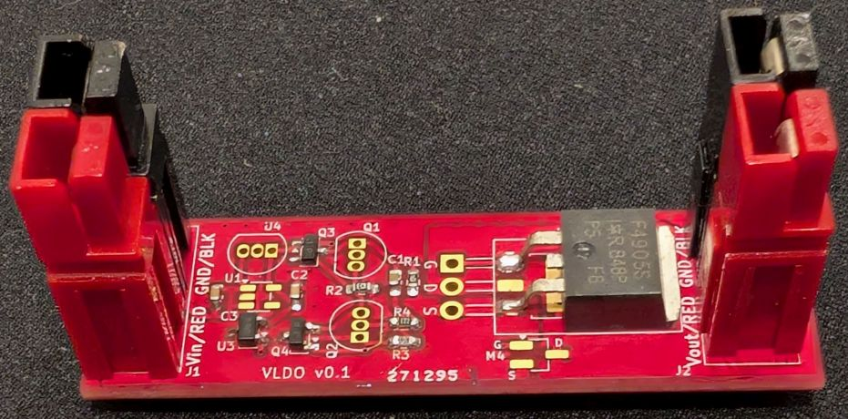
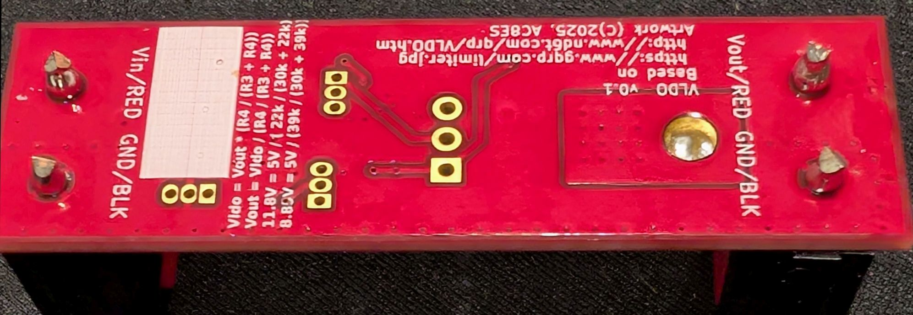
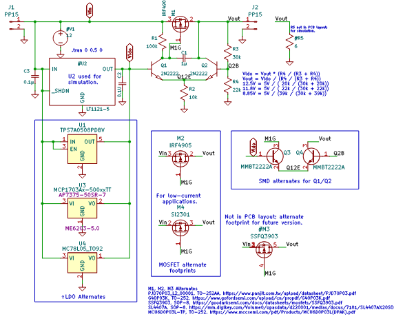
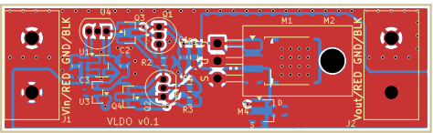
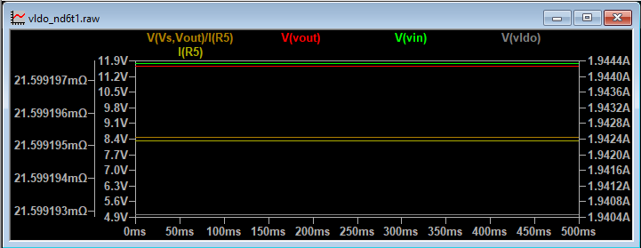
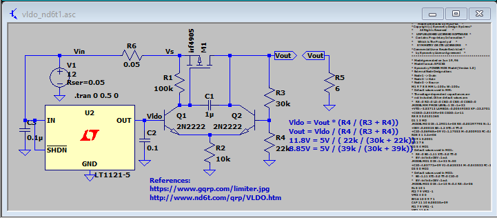
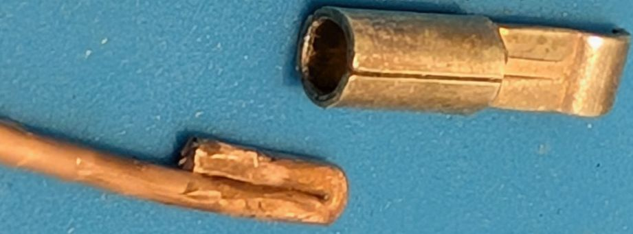
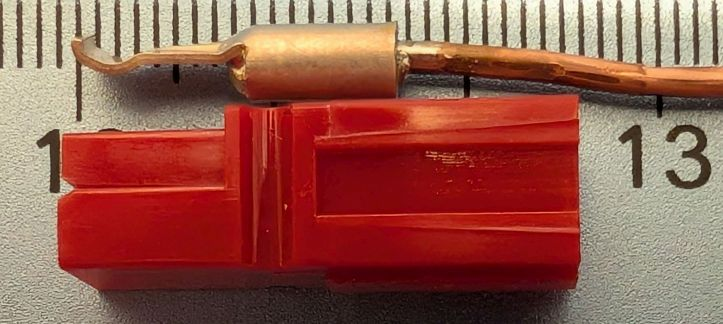
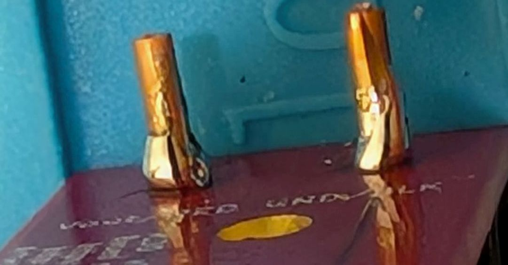

## A Very Low Dropout Regulator Based on G4COL / ND6T

References:
https://www.gqrp.com/limiter.jpg
  via https://groups.io/g/QRPLabs/topic/qmx_battery/111670594
http://www.nd6t.com/qrp/VLDO.htm

PCB, top  
  

PCB, bottom  
  

Schematic  
  

PCB layout  
  

### Output Voltage with a 5V LDO 
The schematic uses a 5V LDO as the reference voltage.  The output voltage is given by: 
```  
Vldo = Vout * (R4 / (R3 + R4))
Vout = Vldo / (R4 / (R3 + R4))
12.5V = 5V / ( 20k / (30k + 20k))
11.8V = 5V / ( 22k / (30k + 22k))
8.85V = 5V / (39k / (30k + 39k))
```  
In practice, depending on the quality of MOSFET used, you may need to tweak the value of R3 or R4.

### Parts Tested in Prototype  
The PCB has alternate footprints for the active components so that alternative parts may be tested, or that the PCB may be built mostly surface-mount or through-hole.  

| RefDes | Part | Source | Comments |   
| ------ | ----------- | ------ | ---------------- |  
| M1 | IRF4905S | https://www.aliexpress.us/item/3256806571411100.html | (TO-263) Works, but runs hotter than expected; Rds_on likely much higher than spec
| M1 | IRF4905 | https://www.aliexpress.us/item/3256806880410046.html | (TO-220 alternate) Part from this supplier does not work well  
| U3 | ME6203A50M3G  | https://www.aliexpress.us/item/3256806655687105.html | (SOT23-3) Works well  
| Q3/Q4 | MMBT2222A  | https://www.aliexpress.us/item/3256806768261444.html | (SOT23-3) Works well  

### Rds(on) Measurement  
The IRF4905S's "ON" resistance, Rds(on), was measured with a [WEL-3005](https://www.hackster.io/john-bradnam/30w-constant-current-load-65ecdd) load tester and a UT161E multimeter.  For each constant-current test of Drain current, Id, below, current was only turned on for 3-4 seconds-- long enough to measure one parameter, but short enough to avoid significantly heating the device.

Device:  IRF4905S, https://www.aliexpress.us/item/3256806571411100.html  
`Calculated Rds(on)= Vds / Id`  

|  Vin   |  Id   | Vds   | Vout  | Vgs   | Rds(on)  |  
| -------| ----- | ------| ----- | ----- | ---- |  
| 13.33  | 0.00  | 1.13  | 12.16 | 1.05  | ---  |  
| 13.28  | 0.50  | 1.12  | 12.13 | 1.51  | 2.24 |  
| 13.29  | 1.00  | 1.10  | 12.13 | 1.62  | 1.10 |  
| 13.20  | 1.50  | 1.06  | 12.12 | 1.70  | 0.71 |  
| 13.16  | 2.00  | 1.01  | 12.12 | 1.76  | 0.51 |  
| 13.11  | 2.50  | 0.96  | 12.11 | 1.82  | 0.38 |  


The LTSpice simulation indicates Rds(on) should be around 21.6Ω  
  

LTSpice simulation schematic  
  

### Power In/Out Connectors  
The prototype used Anderson PowerPole PP15/30/45 housings with PP45 crimp pins as these were on hand -- not the special PCB pins (https://powerwerx.com/printed-circuit-board-pcb-contact-25amp).
The PCB is designed for 14 AWG solid wire. To fit 14 AWG solid wire into a PP45 pin (which is designed for 10 AWG wire), it is folded over at the pin end, then soldered into the PP45 pin.  PP30 pins are deisgned for 12-14 AWG wire and should solder in directly.

14 AWG Wire folded over for PowerPole crimp pin  
  

14 AWG Wire soldered into PowerPole crimp pin  
  

14 AWG Wire soldered into PCB (be sure to cut excess lead length off)  
  


